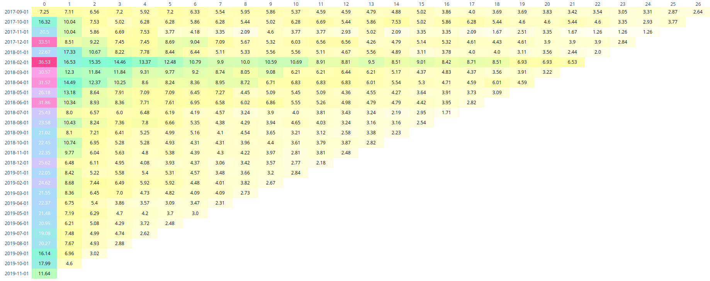

# Monthly cohort analysis
Cohort tables are one of a bunch of mechanisms used to identify trends in customer retention. 

### What question does it answer?

- ##### What percentage of the users `created on month X` are still active `in Y months forward` ?

  Here month ` X` and `Y` are what is known as a `Cohort`, the period which is being analyzed. The analysis is made on the `users created on month X`.

- ##### How does users interactions vary from one cohort to another?

  While the first question analyzes one cohort and its evolution over time, this approach shows how do different cohorts (periods being analyzed, is just that) are compared to one another. 

### SQL, your closest ally 

The main purpose is to get a base raw description of what is wanted to be answer.

#### Schema Models

The base database model has the following schema:

```sql
table client_client(
   ID   INT   NOT NULL,
   created_at timestamp NOT NULL,
   PRIMARY KEY (ID)
);

table order_order(
   ID   INT  NOT NULL,
   created_at timestamp NOT NULL,
   client_id INT NOT NULL,
   PRIMARY KEY (ID)
);
```

Where `client_client` holds information on the registered users where as `order_order` records the user interactions and the date is being performed.

#### Desired output

So, we basically need to go from the schema to the following output:

| cohort_month | total\_users | month\_number | percentage          |
| :----------: | :----------: | :-----------: | :-----------------: |
| 2017\-**09**\-01 | 3446         | 0         | 7\.25  |
| 2017\-**09**\-01 | 3446         | 1         | 7\.19  |
| 2017\-**09**\-01 | 3446         | 2         | 6\.44  |
| 2017\-**09**\-01 | 3446         | 3         | 7\.10  |
| ... | ... | ... | ... |
| 2017\-**10**\-01 | 239          | 0         | 18\.4  |
| 2017\-**10**\-01 | 239          | 1         | 8\.78  |
| 2017\-**10**\-01 | 239          | 2         | 7\.53  |
| 2017\-**10**\-01 | 239          | 3         | 5\.43  |
| ... | ... | ... | ... |

Here I've highlighted the the month number since this is the `cohort interval` we're taking for our analysis. You can see `the total_user` is the same for a given cohort.

We can relate the columns with the `X` and `Y` labels mentioned in the first question. The `cohort_month` columns is equivalent to the X variable and the `month_number` to `Y` one.

The percentage columns is basically the value we're looking for with this analysis. 

#### How do I interpret this?

Well we could take for example the first set of rows corresponding to he first cohort. This is the base story:

> In the month of September, 2017 we had a total number of 3446 users registered in our platform. From this users only 250 (7.25%) of them made an interaction with the platform in the month they month they registered. In the third months after its registration, only 244 (7.10%).

What was the question about? We wanted to know how does on set of users interact with our platform and not only that but the evolution of this interactions. 

Here, let me tell you another story taking the first row from the two cohorts shown in the table:

> From September to October the percentage of users registered decreased by 93% compared to the previous month. Taking a look at the percentage of active users in each cohort we could see that it reduced actually by 18% (250 active users in September against 44 in October).

We should remember that the `cohort analysis is a tool` for answering the big deal questions, **why does this happen?** **what do we do about it?** **how do we profit out of it?** Really interesting questions, doesn't it?

#### Visualizing cohort tables

The sql query returns something we could handle with a little effort since we only analyzed two consecutive cohorts. But imagine you have dozens of cohorts, then you'll have dozens of dozens of values for each of them. What a work. But take a deep breathe and look at this.

 


What, you can't see it clearly. I've used `Plotly` to generate the visualization. Checkout the ipython notebook to see the steps I've take. 

You can check the final product [here](https://plot.ly/~masharo/10.embed).

I'll expand the explanation in the following days. 

Thanks for the reading and happy coding!